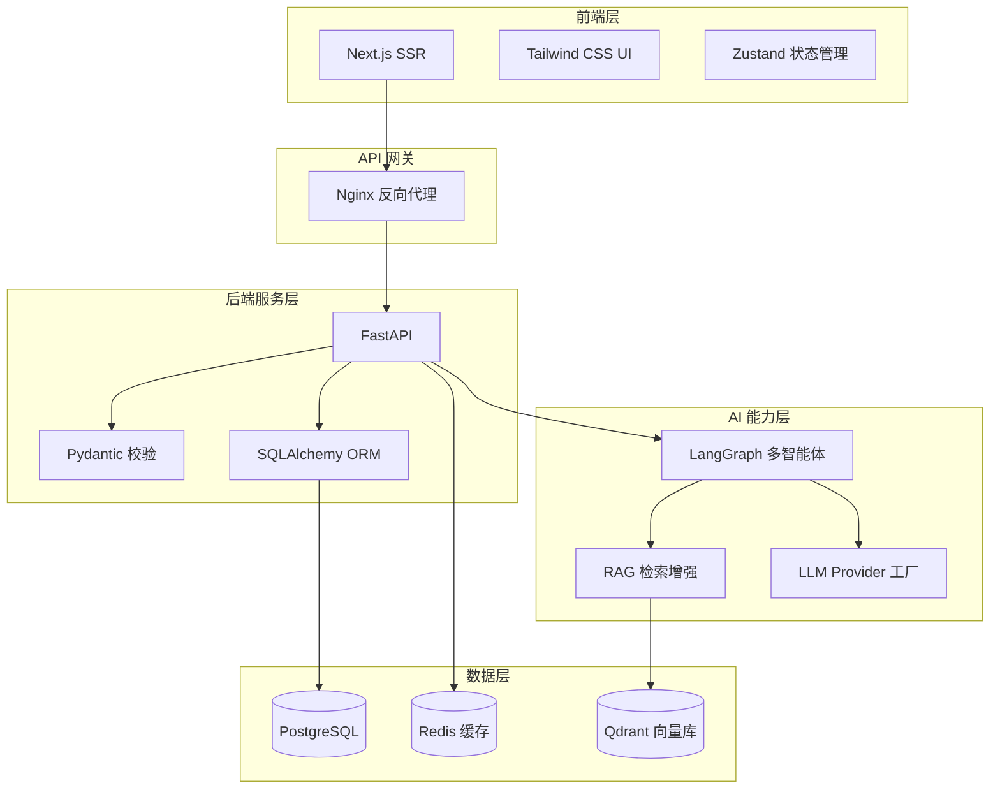
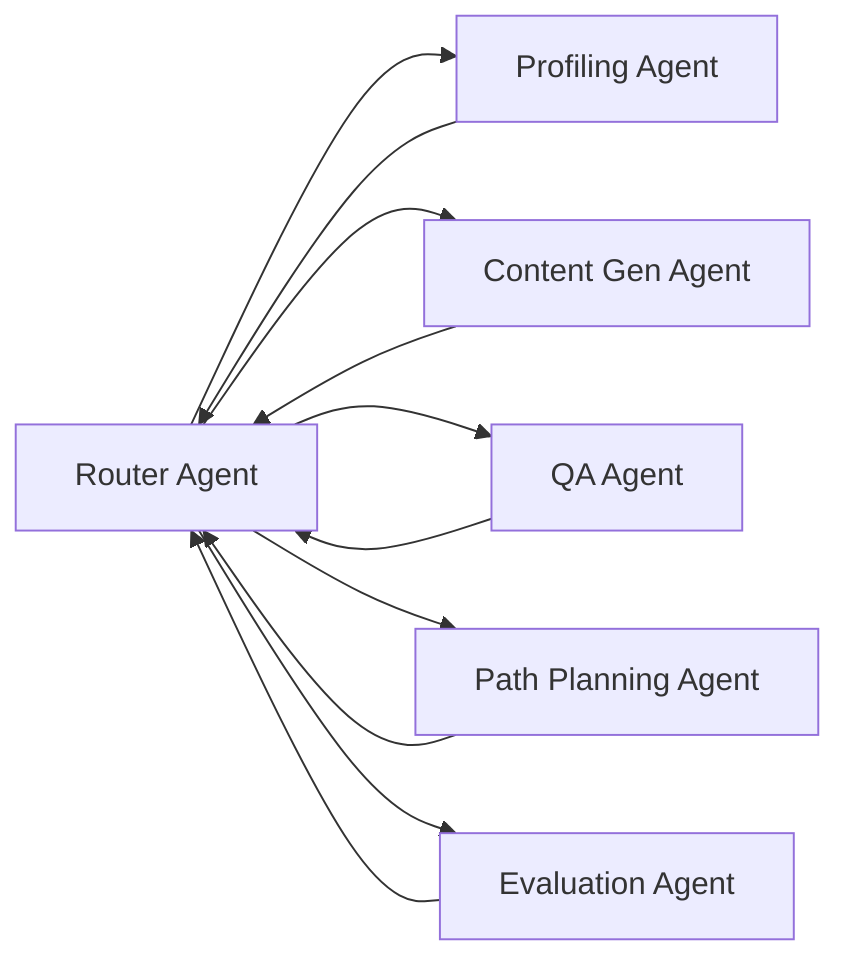
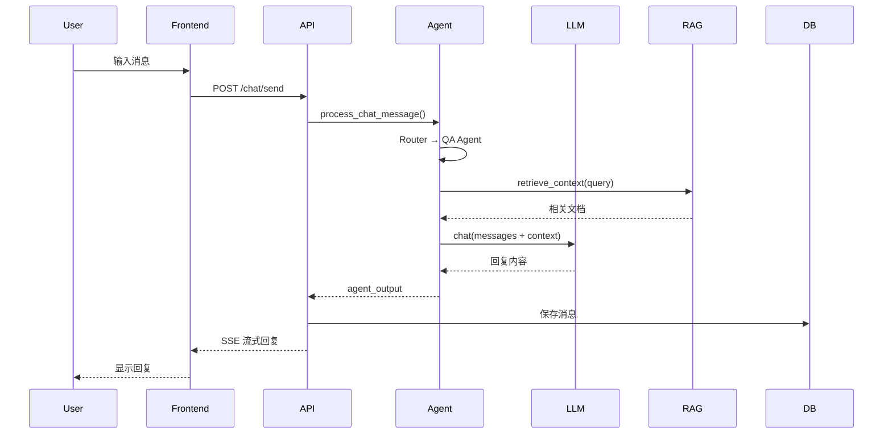

# 架构设计文档

## 系统架构图

## 多智能体架构

## 数据流

## 技术栈总览

| 层级 | 技术 | 用途 |
|------|------|------|
| 前端 | Next.js 14 + React 18 + TypeScript | Web UI |
| 样式 | Tailwind CSS | 原子化 CSS |
| 状态 | Zustand + TanStack Query | 客户端/服务端状态 |
| 后端 | Python 3.12 + FastAPI | API 服务 |
| ORM | SQLAlchemy 2.0 + Alembic | 数据库 |
| Agent | LangGraph + LangChain | 多智能体编排 |
| LLM | 讯飞星火 / DeepSeek / 通义千问 / 智谱 | 大模型 |
| RAG | Qdrant + Sentence-Transformers | 向量检索 |
| 数据库 | PostgreSQL 16 | 关系数据 |
| 缓存 | Redis 7 | 缓存/队列 |
| 部署 | Docker Compose | 容器化 |
